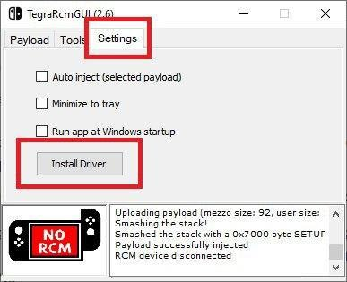
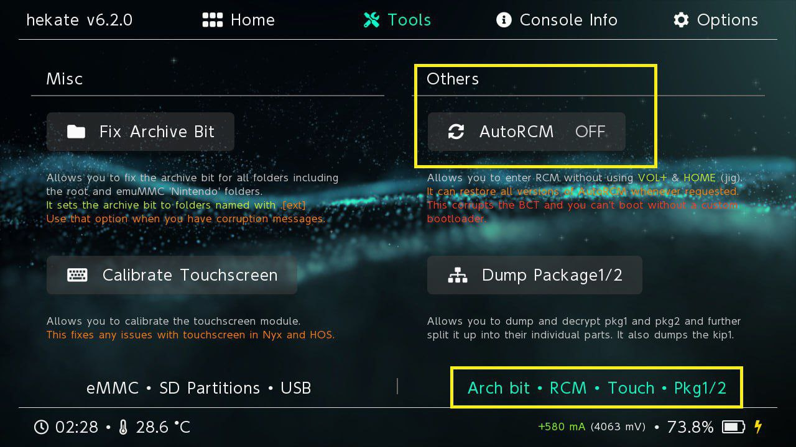
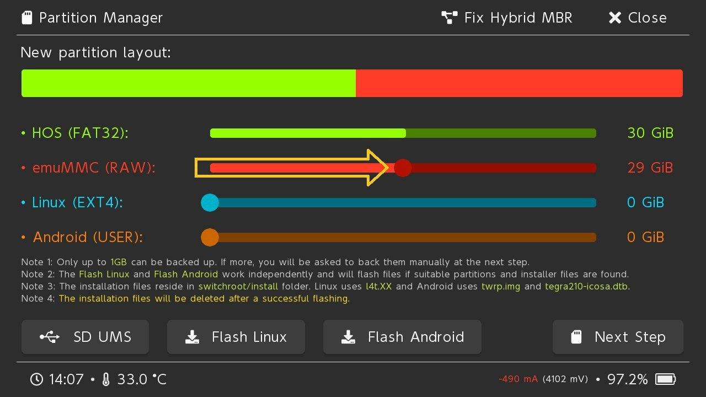

# NSH Atmosphere
## Guia para hackear la Nintendo Switch

### 🚩 Si tienen la consola con modchip estén atentos a los msjs con bandera roja y sigan el ⏭ continuar aquí

### 🏴‍☠️ Si tienen la consola con otro hack estén atentos a los msjs con la bandera pirata y sigan el ⏭ continuar aquí 

## Indice

0. Requisitos necesarios
1. Instalar Drivers RCM
2. Entrar en modo RCM
3. Montar la microSD en la PC
4. Hekate
5. Activar el autoRCM
6. Crear Backup de la sysNAND
7. Guardar el BACKUP en la PC
8. sysNAND o emuMMC???
9. Hack Offline
10. Hack + Online (dual boot)  
    + Particionar/Formatear microSD  
    + Crear una emuMMC
11. Vincular cuenta Offline con LinkAlho  

### REQUISITOS NECESARIOS

Hardware:  
+ Consola Modelo Hackeable
(consultar al bot @NSerialC_bot)
* O consola con modchip instalado 🚩

* Jig RCM (ejemplos)

* MicroSD Clase 10 y superior
(64Gb o mayor si se va a usar una emuMMC, 128gb Recomendado)

* Cable USB type-C a type-A

* PC con Windows

(Opcional a la PC)

* Celular Android + Cable + OTG
(link app Rekado)

* RCM Loader

* Modchip 🚩

Software:  
para la microSD
⏬ nsh-atmosphere.7zip

para la PC:  
⏬ TegraRcmGUI (Windows)
⏬ nsh-payload.bin

👆Para acceder a los link tienen que ser parte del Grupo NSH

❗️❗️❗️IMPORTANTE

Si es la primera vez que van a usar una microSD de 64gb o mayor en su Nintendo Switch.

Tienen que poner dicha microSD en la Switch para que les pida una actualización de sistema, para dar soporte a sdXC y exFAT.
* Instalar esa actualización (requiere internet)

*Preguntar en el grupo si el hack funciona con el último Firmware (o si funciona con el firmware que aparece en tu consola en el apartado de configuración>consola)

❗️❗️❗️IMPORTANTE 2

᛫Si se tiene Control Parental activado, por favor desactivarlo antes de empezar. 🔞
᛫Si se tienen activado el guardado en la nube, por favor desactivarlo antes de empezar. ☁️

᛫Poner la consola en modo avión ✈️

🚩 Si tienen la consola con modchip
solo descomprimir el pack nsh-atmosphere en la SD
y luego al encender la consola les debería iniciar en Hekate

*Con modchip no se puede inyectar nada por RCM, así que el metodo para montar la microSD vía TegraRcmGui no les sirve.
saquen la microSD y montenla a un lector de tarjetas (a un celular también puede ser)
y...

⏭ continuar aquí

### Instalar Drivers RCM

En la PC abrir el programa TegraRcmGui.exe

(Si les pregunta para instalar los drivers es por que se adelantaron y conectaron el cable usb 😋)  

  
Cambiar a la tercer pestaña "Settings" y presionar el botón "Install Driver"

### Entrar en modo RCM

En la Switch colocar el Jig en el riel donde va el joy-con derecho, dejarlo bien firme hasta abajo como si fuese el joy-con, mantener presionado el botón de Volumen+ y presionar el boton de Power.

  

  
Conectar el cable USB a la Switch y a la PC.

  
Si al presionar el botón de power o al conectar el cable a la PC se enciende la consola y aparece el logo de Nintendo, algo salió mal, Apagar y repetir los pasos para entrar en modo RCM.

La consola debería quedar con la Pantalla Negra, eso significa que inició en modo recovery (RCM) y si tienen el cable conectado a la PC y el TegraRcmGui abierto van a ver que la imagen queda verde y dice RCM OK.

### Montar la microSD en la PC

    

❕Sin sacar la microSD de la Switch.

Usando el TegraRcmGui cambiar a la segunda pestaña "Tools" y presionar el botón con el logo de USB, esto les va a montar la microSD que está en la Switch en la PC (como si fuera un pendrive).

El logo verde pasará a ser rojo.
porque la consola ya no estará en modo RCM, sino que en modo transferencia de archivos.

⚠️ No quitar el JIG de la consola

🏳️ Si su consola está original y tiene juegos instalados,
Guardar en la PC la carpeta "Nintendo" y borrarla de la sd.
(esto se hace para conservar los juegos originales que tienen, sino les interesa conservar nada, simplemente borren la carpeta Nintendo)

🏴‍☠️ Si ya tenían la consola con otro hack es posible que tengan alguna de las siguientes carpetas: "Nintendo", "emuMMC", "sxos", "Emutendo"
Guardar dichas carpetas en la PC y borrarlas de la sd.

⚠️ La microSD NO tiene que tener mas de 1GB ocupado o van a perder todo lo que contenga, si la pueden vaciar mucho mejor!

  
En mi PC van a ver la microSD montada

Descomprimir el archivo nsh-atmosphere.7zip suelto en la sd

La microSD debería quedar mas o menos con estas carpetas.

  
Salir del modo transferencia

Presionado durante 5 segundos el botón power, la switch se desconectará.

Encender nuevamente la consola en modo RCM con el JIG puesto, y seguir con el paso siguiente.

Inyectar el payload

  
En el TegraRcmGui cambiar a la primer pestaña "Payload",
allí presionar en el botón de la lupa,
buscar y abrir el archivo “nsh-payload.bin”
luego presionar el botón “Inject payload”

💡Consejo, dejar el nsh-payload.bin en una carpeta que no les moleste en la PC y en el TegraRcmGui tocar el botón + para guardarlo como favorito.

⚠️ Ya pueden quitar el JIG de la consola
y dejar el joy-con derecho.

### Hekate

  
Debería encenderse la Switch y quedar en el menú de Hekate, que es un "bootloader" o "Gestor de arranque"

🚩 Si tienen un modchip no van a poder activar el autoRCM y no es necesario ya que el chip se encarga de inyectar sin necesidad del modo RCM
⏭ continuar aquí

### Activar el autoRCM

  
En Hekate cambiar a la pestaña "Tools" y luego bien abajo a la derecha tocar en la sub-pestaña
"Arch bit * AutoRCM * Touch * Partitions"

Y allí presionar en botón "AutoRCM"

  
Presionar OK.

Con eso debería quedar activado el autoRCM y ya no sería necesario colocar el jig para iniciar en RCM, basta con tocar Power y la consola inicia con la pantalla apagada

✅ Ya pueden quitar el JIG de la consola

⚠️PRECAUCIONES CON EL autoRCM

1) Si apagan la switch y después quieren encenderla, no va a iniciar. la consola SOLO inicia inyectando un payload.

2) Si se quedan sin batería y no les deja inyectar el payload, tranquilos la consola solo se quedo TOTALMENTE sin batería.
Déjenla cargando, en RCM también carga, solo que bastante más lento.

Dejar cargando unos 30min mas o menos, preferiblemente con el cargador directo, eso le dará muy poca carga pero ya será suficiente para que puedan inyectar el payload.

Sino funciona, quitar el cable usb y mantener el botón de power presionado por 15seg y volver a intentar.

### Crear Backup de la sysNAND
(Opcional pero recomendado)

backup de la memoria interna de la switch, se requiere de 30gb disponibles en la microSD.

  
En Hekate cambiar a la pestaña "Tools" y tocar el botón "Backup eMMC"

Presionar en el botón
"eMMC Boot0 & Boot1"
y cuando finaliza presionar "Close"

  
Presionar en el botón "eMMC RAW GPP"
y cuando finaliza presionan "Close"

Esta parte del proceso puede demorar unos 10 a 30 min. dependiendo de la velocidad de su microSD

Al finalizar tendrán la copia de seguridad en la carpeta "backup" de su microSD.
pesa 29gb aproximadamente

### Guardar el BACKUP en la PC
#### y Borrarlo de la microSD.

Sugerencias
* Pueden comprimir el backup con 7zip para que pese menos
* Pueden subir el backup a la nube de telegram (sus msj guardados)

En el siguiente msj se enseña como montar la sd sin sacarla de la swich!
O sea usarían la switch como si fuera un lector de microSD 😊

💚 Se recomienda hacer esto cada vez que se quiera acceder a la sd de ahora en adelante, nada de estar sacando la sd a cada rato y correr riesgo de dañar el lector de microSD de tanto saca y pone.

  
En el menu de "Tools", ir a "USB Tools"

  
Presionar el botón "SD Card"

Aparecerá un cartel en la switch esperando que la conectemos a la PC. Conectar el cable USB en la switch y en la PC. Luego aparecerá nuestra SD montada en la PC como un Pendrive.

Le dan a cortar la carpeta backup de nuestra SD y la pegamos en la PC.
(osea el backup solo queda en la PC, ya no lo necesitan en la sd)

Este proceso puede demorar unos 10 minutos. Si tenían juegos en la sd, entonces saquen de la sd tambien la carpeta Nintendo (pueden comprobarlo si la carpeta pesa mas de 22mb ).

🖥 Al finalizar expulsen el USB desde la PC, tal cuál como cuando expulsan un Pendrive.

⚠️Los archivos de la microSD No deben superar 1gb para luego poder crear la emuMMC.

### ⚠️EN ESTE PUNTO TIENEN QUE ELEGIR, si usar el CFW directamente sobre la sysNAND(memoria interna) o crear una emuMMC(memoria emulada) para separar el hack‼️

  
#### Hack + Online 🔵
Si les interesa seguir jugando a sus juegos comprados y usar el Online pago de Nintendo, necesitan dejar la sysNAND limpia, y para lograr eso Necesitan una emuMMC, para hacer dual boot.

Sigan el tuto desde acá!
👆🚩Si usan un modchip es muy recomendable usar una emuMMC.

#### Solo Hack (Offline) 🔴
Si en cambio solo quieren tener el hack para juegos offline, con poner los archivos del pack del grupo ya es suficiente... Pero recuerda que el creador del cfw 🙌 Atmosphere🙌 recomienda que nuestra SD esté en formato Fat32.

Si tu SD no está en ese formato sigue los siguientes paso para formatearla :)

Si tu SD ya está en fat32 sigue a partir de aquí ✨

### Formatear la microSD en Fat32

RECOMENDAMOS formatear la sd en Fat32 ya que es el formato correcto para el hack.

  
En la pestaña "Tools" tenemos la opción "Partition SD Card"

  
Al abrirlo aparece el msj que nos informa que se va a realizar un backup de los datos de la sd.

⚠️No más de 1Gb

Si la sd tiene mas de 1GB no podrá hacer un backup de los archivos y se borrará todo.

Mientras mas vacia la sd, más rápido es el proceso, darle OK.

  
Aquí no movemos absolutamente nada (ya que no vamos a hacer ninguna partición) y solo presionamos el botón "Next Step"

  
Nos preguntará si queremos continuar.
Presionar el botón "Start"

⚠️Si los archivos en la SD pesan mas de 1gb, nos saldrá un cartel advirtiendonos y dando como opción conectarla a la pc para extraer las cosas de sobra (Por lo general es la carpeta Nintendo)

  
Cuando finalicé nos mostrara este msj.
Presionar "OK" y luego "Close"

Entonces ahora si, con la SD en su formato recomendado ya están listos para ejecutar el hack como lo indica el paso siguiente.

### Solo Hack (Offline) 🔴

SOLO USAR LA OPCIÓN
En el menú de Hekate =>
Launch => CFW(sysNAND)

  
🚫NUNCA usar la otras opciones.
Launch=>CFW(emuMMC)
👆les daría error.
Launch=>Stock(sysNAND)
👆les banearian.

⚠️Una vez que inicia, ir al último paso para crear una cuenta fake de Nintendo, varios juegos lo requieren.

##########################

#############################

### Hack + Online 🔵

Particionar/Formatear microSD

RECOMENDAMOS crear una partición en la sd para usar como emuMMC.

Hekate nos permite sencillamente crear una particion para la creacion de la emuMMC

  
En la pestaña "Tools" tenemos la opción "Partition SD Card"

  
Al abrirlo aparece el msj que nos informa que se va a realizar un backup de los datos de la sd.
⚠️No más de 1Gb
Mientras mas vacia la sd, más rápido es el proceso, darle OK.

  
Movemos el punto rojo de la emuMMC hasta la mitad

(eso no significa que vaya ocupar la mitad del espacio 29GB dice, 59Gb dice en las OLED)

Pero por el amor de Dios, es simple la consigna, MOVER HASTA LA MITAD esa barra roja 🙈🙈

y presionar el botón "Next Step"

  
Nos preguntará si queremos particionar nuestra SD.
Presionar el botón "Start"

⚠️Si los archivos en la SD pesan mas de 1gb, nos saldrá un cartel advirtiendonos y dando como opción conectarla a la pc para extraer las cosas de sobra (Por lo general es la carpeta Nintendo)

  
Cuando finalicé nos mostrara este msj.
Presionar "OK" y luego "Close"

#### Crear una emuMMC

  
Desde el menu principal, presionan emuMMC

  
Presionan en el botón "Create emuMMC"

  
Eligen la opción "SD Partition"

  
Presionar "Part 1"

  
el proceso lleva unos 10 a 30 minutos, dependiendo de la velocidad de su microSD

Presionar "Close"

  
Ahora deberían ver la emuMMC info Enabled! en verde.

Si no dice Enabled presionan el botón Change emuMMC y eligen
a la izquierda “SD RAW”

Con esto ya tienen un emuNAND creada! 😉👍

Para finalizar deberán montar la sd en la PC desde Hekate.
Tools=>USB tools=>sd card.

Y volver a copiar la carpeta Nintendo a la sd, la que hicieron un backup al inico del tutorial.

Esta tiene todos los juegos originales que alguna vez descargaron de manera legal.

Presionan Close para llegar a la pantalla Home de Hekate y eligen:

  
🏴‍☠ Cuando quieren Atmosphere
Launch=>CFW (emuMMC)
y ⏩ continuar aquí

🏳 Cuando quieren lanzar el Sistema Original
Launch=>Stock(sysNAND)
(para jugar online sus juegos originales)

🏴 Nota Importante‼️
Si vienen de otro hack y no usaban una emuNAND, van a tener que formatear la sysNAND para dejarla limpia de nuevo, solo en esos casos les recomendamos usar la siguiente opción 1 vez, formatean, reinician y ya luego siempre usan STOCK

❌ NO usar la opción
Atmosphere sobre sysNAND
Launch=>CFW(sysNAND)

(Esa opción es para los que no querían una emuMMC, los que eligieron la pastilla roja 😋)

En caso de Iniciar sin querer así, van a ver que el logo splash será rojo, no hagan nada solo reiniciar rápidamente y elegir la opción correcta.

Al iniciar CFW(emuMMC) por primera vez van a ver los mismos juegos que tenían instalados en la sysNAND, pero con una nube arriba, no van a estar disponibles.

Tienen que desinstalar todos los juegos que les aparece, ya que esos solo están registrados pero no instalados.

⏩ continuar aquí👇👇👇

### Vincular cuenta Offline con LinkAlho

  
Algunos juegos requieren una cuenta vinculada de Nintendo, y no es recomendable usar la cuenta real de Nintendo, así que deben vincular su usuario con una cuenta fake con la app LinkAlho.

La app no les va a borrar el usuario ni los saves, simplemente les permite desvincular su cuenta y/o vincular con una cuenta fake

Tutorial para el LinkAlho

👆Para acceder a este link tienen que estar suscriptos al Canal NSH Tutoriales
